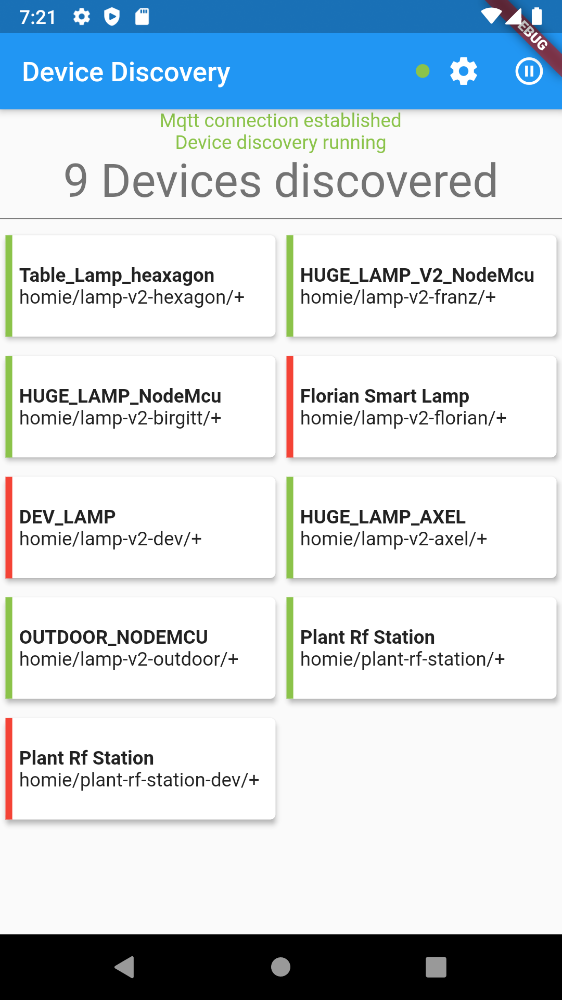
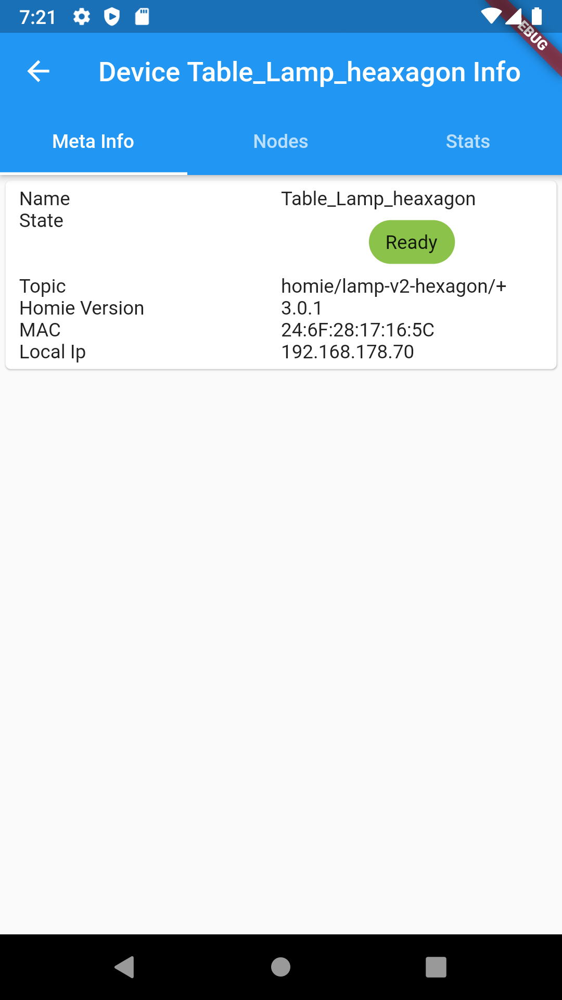
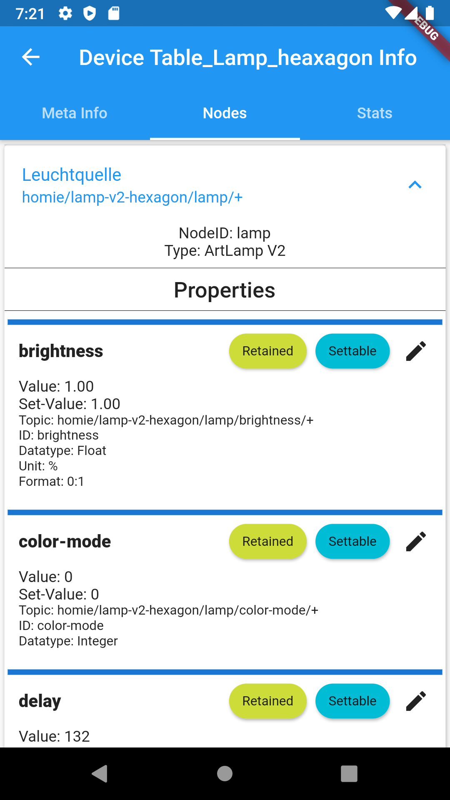
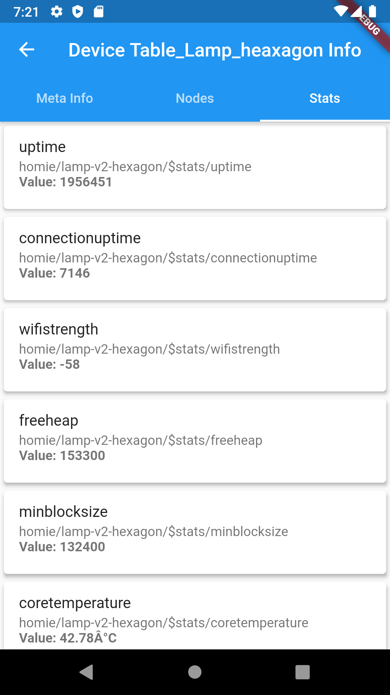

# FlutterHomie

A Flutter project creating a App to discover and manage HomieDevices.
I started this project to learn creating a app with Flutter thats somewhat usefull to me and maybe others. 

Since this is my first ever written mobile App I experiment with different patterns and flutter-packages.

It took my quite some time to get a somehow working MQTT Provider/Connection and I am still not satisfied with the current
implementation. Any input for that and other improvements are welcomed!

##Features
* Discover devices
* Show device attributes and list device nodes and stats
* Edit properties of nodes currently: Color, Int, Float, Boolean, String

###Screenshots

Device Discovery Screen           |  Device Details
:------------------------------------------------------:|:-------------------------------------------------------:
  |   
Nodes Tab           |  Stats Tab
  |   

## Dev Notes
To Generated Auto-Gen freezed files:\
flutter pub run build_runner build